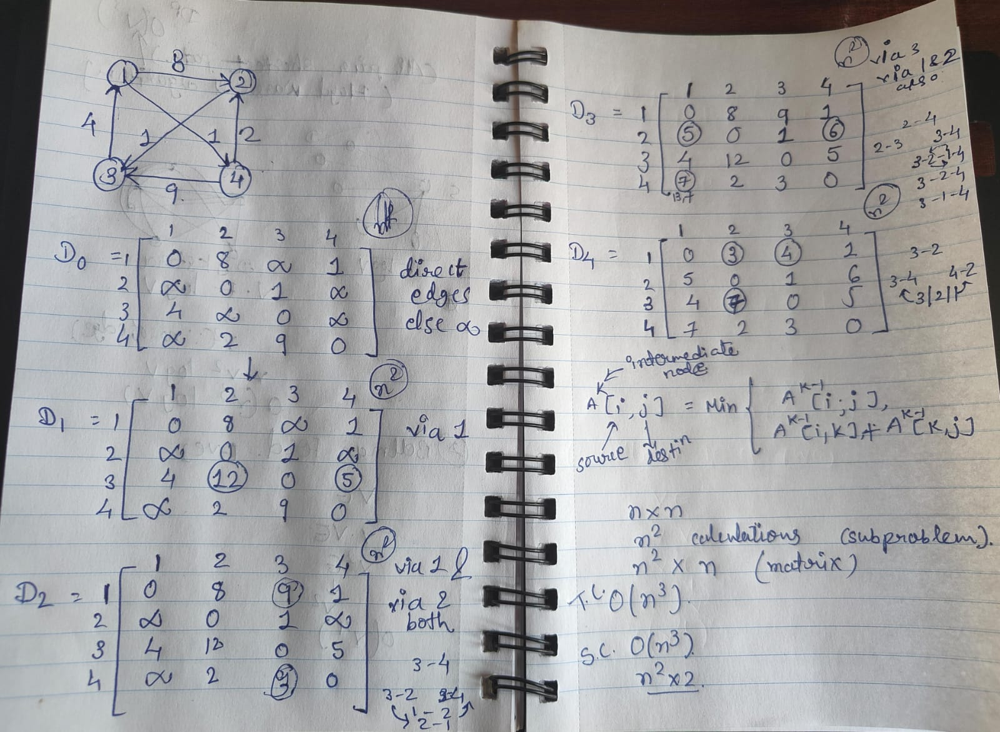

- Visiting all nodes in given graph with shortest path, or via some other nodes, repating the process for all nodes

- One source, multiple destination

- Here graph can be directed or undirected or +/- weights

- Distance matrix
    1. Direct edge -> ass weight
       No direct edge -> put infinite

       D0

    2. Consider Path via 1

    3. Consider Path via 2 & 1 for min 

    4. Consider Path via 3 & 2 or 1 for min 

    5. Consider Path via 4 & 2 or 1 or 3 for min 

- # Floyd-Warshall Algorithm

The Floyd-Warshall algorithm is a dynamic programming solution for finding the shortest paths between all pairs of vertices in a weighted graph. This algorithm can handle both directed and undirected graphs and is capable of working with graphs that have negative weight edges, though it cannot process graphs with negative weight cycles.

## Algorithm Overview

The Floyd-Warshall algorithm iteratively updates the shortest path estimates between all pairs of vertices by considering all possible intermediate vertices that could be part of the path between any two vertices.

### Steps

1. **Initialization**: Initialize a distance matrix where the distance `d[i][j]` represents the shortest distance from vertex `i` to `j`. Initially, `d[i][j]` is set to `∞` for all pairs of vertices except where `i = j` (where it's set to `0`) and for pairs `(i, j)` that are directly connected by an edge (where it's set to the weight of the edge).

2. **Iteration**: For each vertex `k`, update the distance `d[i][j]` for all pairs of vertices `(i, j)` to the minimum of the current distance `d[i][j]` and the sum `d[i][k] + d[k][j]`. This process is repeated for each vertex `k`, effectively considering `k` as an intermediate vertex in the shortest path from `i` to `j`.

3. **Negative Cycles**: After updating distances, check for the presence of negative weight cycles by verifying if any `d[v][v] < 0` for any vertex `v`. A negative value indicates a cycle with overall negative weight.

## Algorithm Complexity

- **Time Complexity**: \(O(V^3)\), where \(V\) is the number of vertices in the graph. The algorithm requires three nested loops over all vertices.
- **Space Complexity**: \(O(V^2)\), due to the storage requirement for a two-dimensional distance matrix.

## Implementation Highlights

- **Dynamic Programming**: This algorithm is a classic example of dynamic programming, building the solution using previously solved subproblems.
- **Path Reconstruction**: Although the primary goal is to find the shortest distances, the algorithm can be adapted to reconstruct the shortest paths using a predecessor matrix.
- **All-Pairs Shortest Path**: Unlike single-source shortest path algorithms like Dijkstra's or Bellman-Ford, Floyd-Warshall computes the shortest paths between all pairs of vertices.

## Applications

- **Network Routing**: The algorithm is utilized in network routing protocols for determining the shortest path through a network.
- **Transitive Closure**: It can be employed to find the transitive closure of a directed graph.
- **Real-World Routing**: Useful for calculating shortest paths within dense graphs, such as in urban traffic networks and flight route planning.

The Floyd-Warshall algorithm is particularly advantageous in situations where the graph is relatively small and dense or when there's a need to frequently query the shortest distance between any two vertices after initial processing.

    
